# Planner
[**Planner**](https://planner-1da50.web.app/login) is a responsive web application for task management built using React. It allows users to create and maintain tasks and is hosted on firebase.

## Key functionalities:
1. User authentication with email-password. Google and Github authentications are also supported.
2. Unlimited custom Lists and Tags and associating tasks to them.
3. Task priorities, scheduling and recurring tasks.
4. Calendar time blocking with a dedicated calendar view.
5. Multi select to delete or restore tasks.
6. Sort by priority or date (in list view) and Color by priority or list (in calendar view).

## Here are some screenshots to guide you through the app.
### Web view    
|   |   |
| ----  | ----  |
|   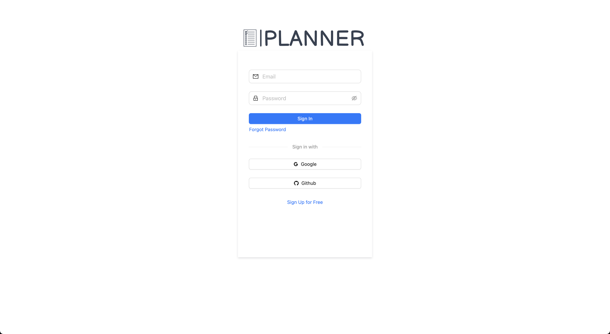                             | 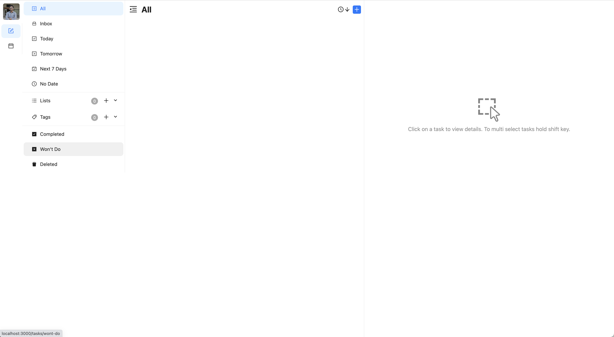                       |
|   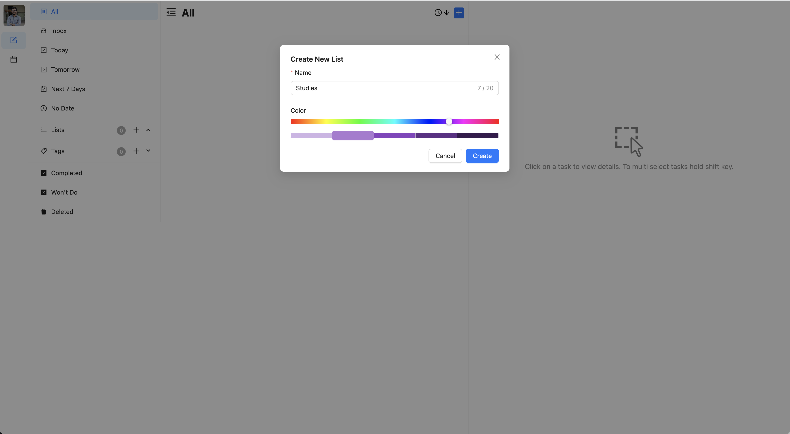                         |   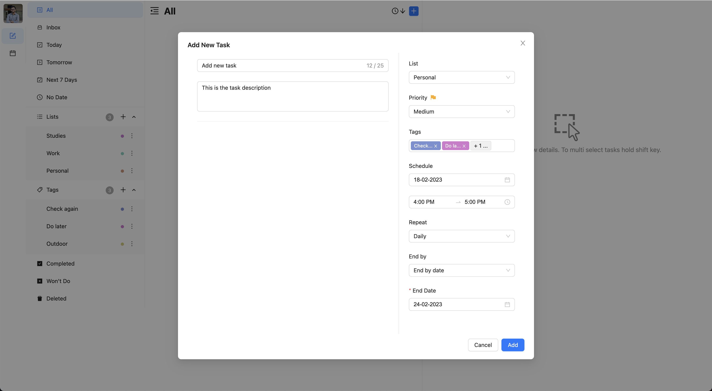                       |
|   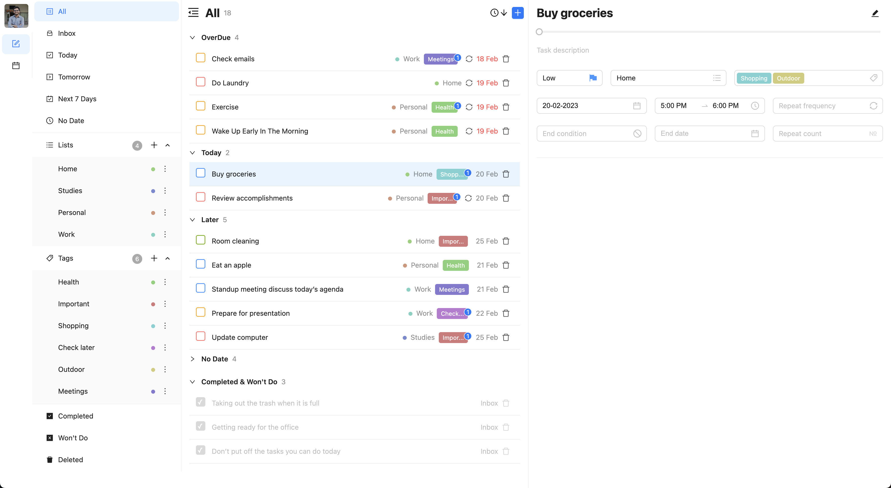                             | 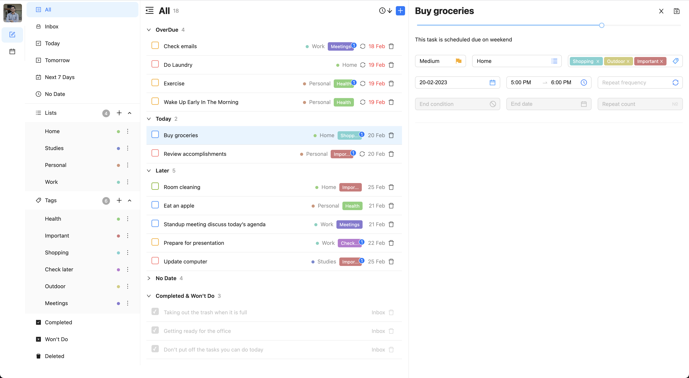                     |
|   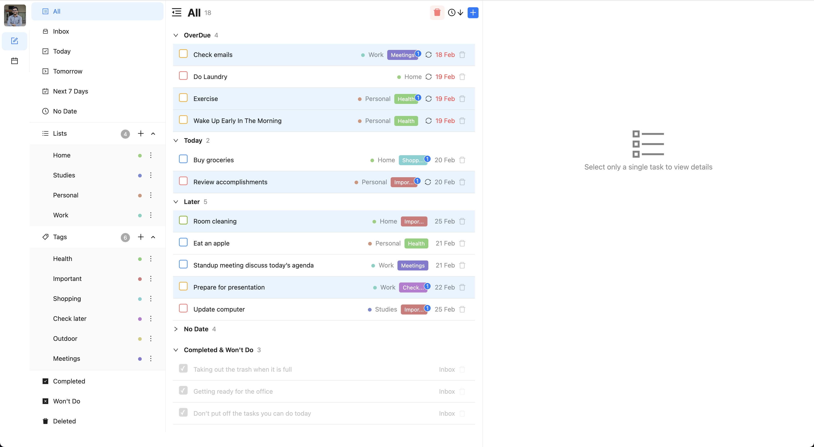                        | 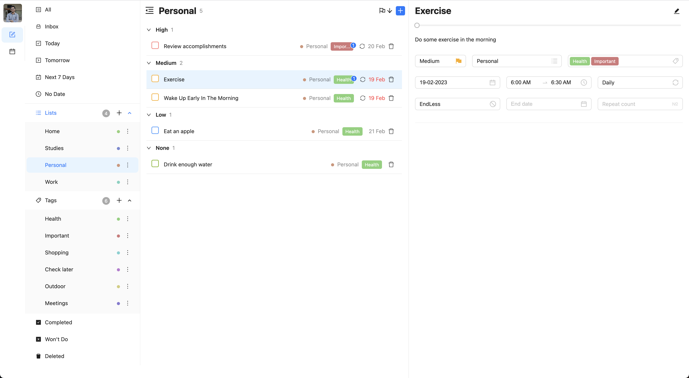        |
|   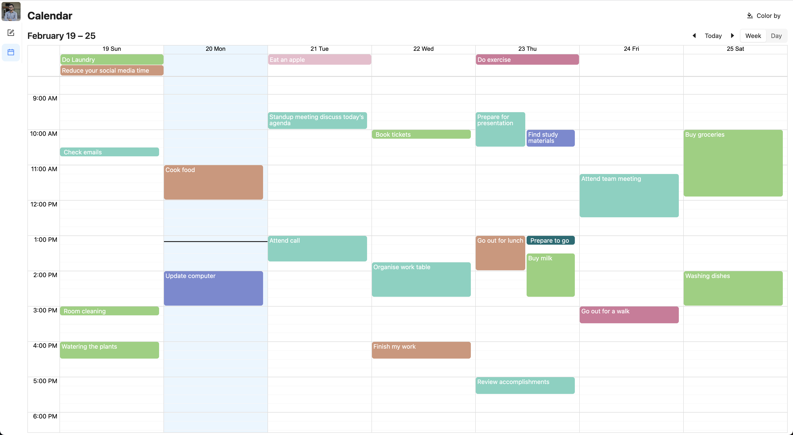                             | 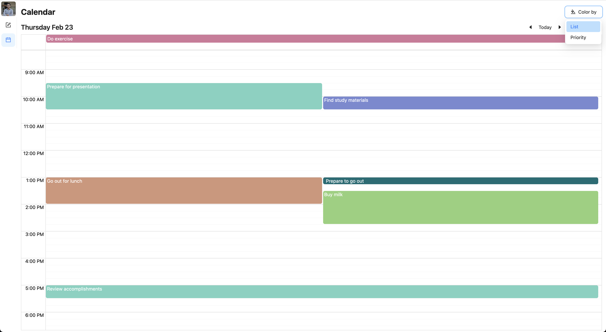                       |
|   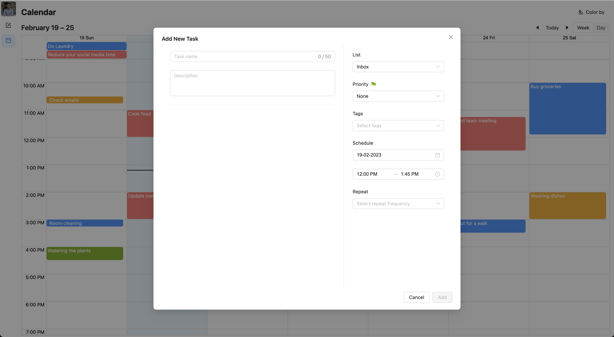    |     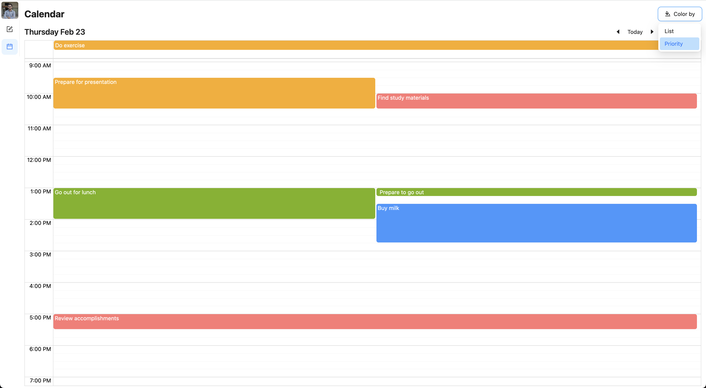  |

### Mobile view
|   |   |   |
|   ----  | ----  | ----    |
| 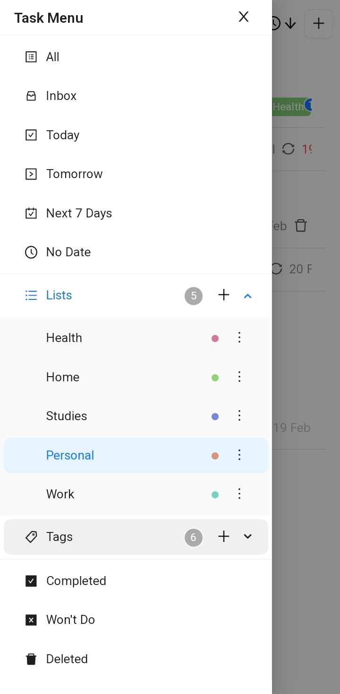    |    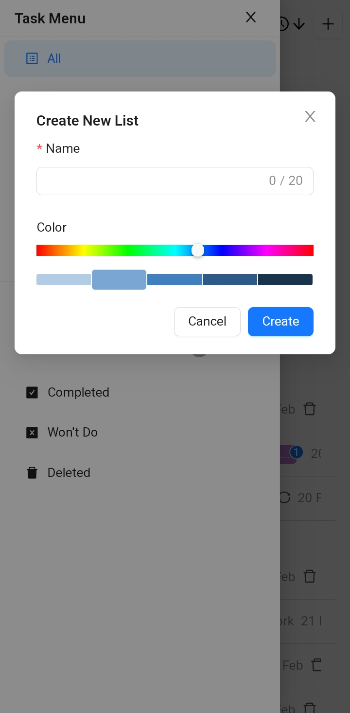  | 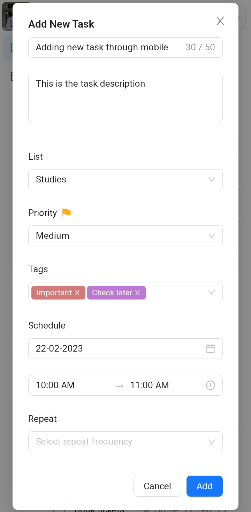  |
|   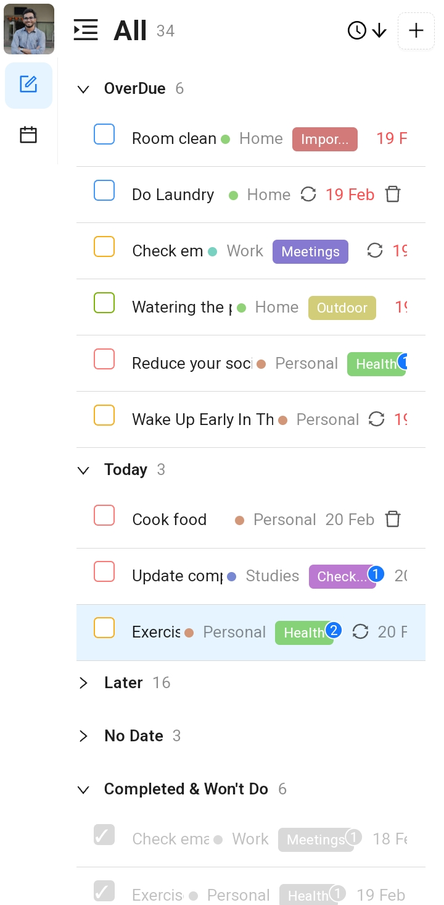    |   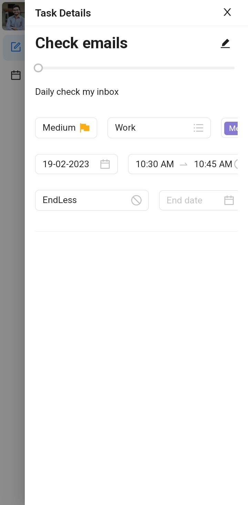  |    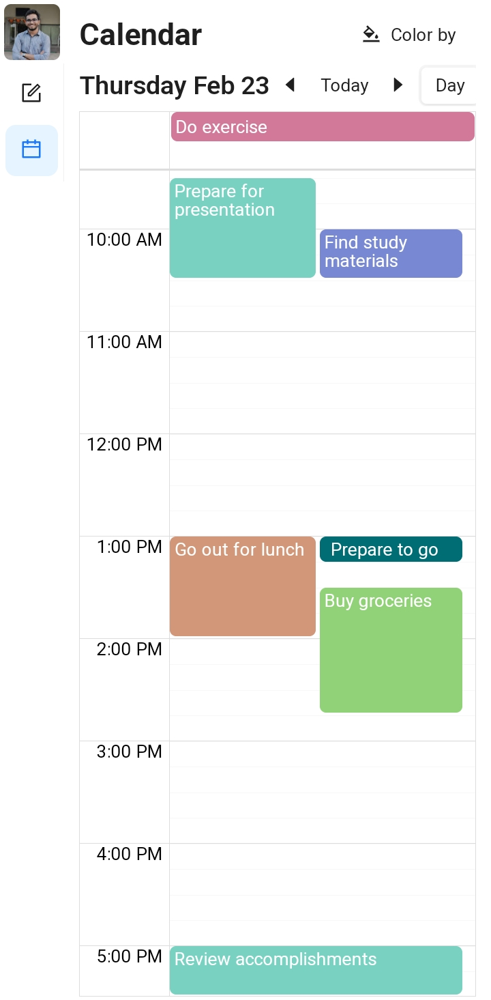  |